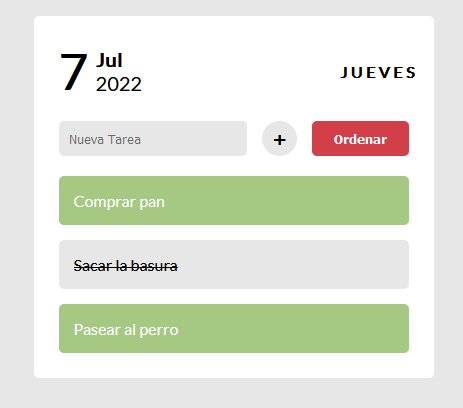

# Aplicación To-Do ✔️

✅ Aplicación To-Do responsiva realizada con las siguentes tecnologias:

- Javascript
- Css
- HTML

---
Utiliza la fuente [Lato](https://fonts.google.com/specimen/Lato?query=lato), que pueden ver haciendo click en el enlace, tiene la función de mostrar la fecha local.

---
